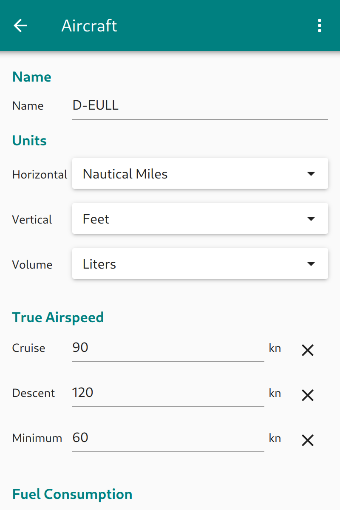

Installation and setup
======================

App installation
----------------

Installation on Android devices
  **Enroute Flight Navigation** is available as an Android App in the `Google
  Play Store
  <https://play.google.com/store/apps/details?id=de.akaflieg_freiburg.enroute>`_.

Installation on Linux desktop machines
  **Enroute Flight Navigation** is available for free download at `flathub.org
  <https://flathub.org/apps/details/de.akaflieg_freiburg.enroute>`_ and
  `snapcraft.io <https://snapcraft.io/enroute-flight-navigation>`_.  Most likely
  you will also find the app in the software management application on your
  computer.

After installation, start the app.  Depending on the platform, you might need to
grant the necessary permissions.  You will be asked to accept the terms and
conditions.

Map download
------------

**Enroute Flight Navigation** cannot be used without geographic maps.  Three
types of maps need to be installed for every region where you fly.

- Aeronautical maps.  These contain airspaces, airfields and navaids.  Some maps
  also contain reporting points, airfield traffic circuits and control zone
  entry/exit routes.
- Base maps.  These contain geographic data, such as rivers, roads, railroads
  and land use.
- Terrain maps, which contain elevation data. At present, terrain maps are used
  to show a shaded terrain relief. We expect that future versions of the app
  will use terrain elevation also for navigational purposes.

Follow these steps to install the maps that you need.

- Open the Menu by touching the menu button in the upper right side of the
  screen.  The button is marked with the symbol '☰'.
- Choose the menu item *Library*, then *Maps and Data*.  The data management
  page will then open.
- On the map management page, click or tap on the desired maps.  The maps will
  be downloaded and installed on your device.

Please download only those maps that you will actually need.  The infrastructure
and bandwidth for map downloads is kindly sponsored by the University of
Freiburg, under the assumption that the cost stays within reasonable limits.
You will also find that the app performs much better if it does not have to
process many megabytes of map data.
  
.. note:: Do not forget that you need aeronautical maps, base maps **and** 
    terrain maps for the desired area of flight.  The base maps are large.  Make 
    sure that you have a good internet connection before you download maps.  It 
    might be inadvisable to download base maps via the mobile phone network.

Once the map download has finished, **Enroute Flight Navigation** will process
the map data and update the map display after a minute or so.  Tap or click on
the arrow symbol '←' or use the Android 'Back' button to leave the map page and
return to the main screen.

.. _setUpSetAircraft:

Set aircraft specifics
----------------------

We recommend that you tell **Enroute Flight Navigation** a little about your
aircraft before you fly.

- Open the Menu by touching the menu button in the upper right side of the
  screen.
- Choose the menu item *Aircraft*. The aircraft page will then open.

.. _aircraft:

   Aircraft specifics

Please fill in the relevant data. While not every data item is used in the
present version of **Enroute Flight Navigation**, we expect that future versions
of the app will use all the data that is requested on this page.

Tap or click on the arrow symbol '←' or use the Android 'Back' button to leave
the map page and return to the main screen.

Done.
-----

You are now ready to go.  There are many things that you could set up at this
stage, but we recommend that you simply look around and play with the app.
Continue with the next section and take it for your first flight.
