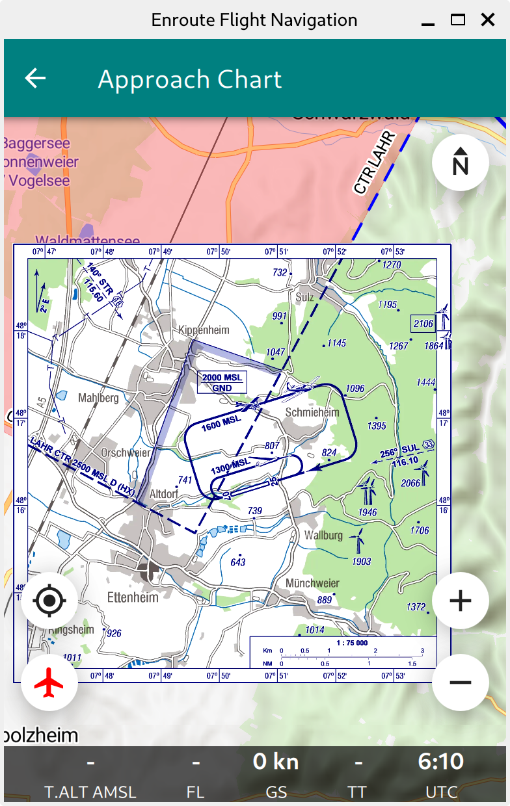

Import visual approach charts
=============================

**Enroute Flight Navigation** is able to import visual approach charts and
display them in the moving map.  The figure :ref:`vac` shows how this will
typically look.

.. _vac:

   Moving map display with embedded approach chart

**Enroute Flight Navigation** accepts visual approach charts in one of the
following formats.

* Geo-referenced image files in GeoTIFF format.
* TripKits, as produced by the latest beta-version of the `AIP Browser DE
  <https://mpmediasoft.de/products/AIPBrowserDE/help/AIPBrowserDE.html>`_

.. note:: GeoTIFF is a complex format that supports a wide range of use
  cases. For simplicity, **Enroute Flight Navigation** only supports a 
  restricted subset of the GeoTIFF standard. If you encounter a GeoTIFF 
  file that is not recognized by **Enroute Flight Navigation**, please 
  `open an issue report 
  <https://github.com/Akaflieg-Freiburg/enroute/issues/new/choose>`_.
  We will be glad to help!

.. note:: This section describes a new feature that is currently in a beta 
  test phase. At present, the feature is only available for a small group
  of beta testers.

Obtain approach charts
^^^^^^^^^^^^^^^^^^^^^^

Michael Paus' free software `AIP Browser DE
<https://mpmediasoft.de/products/AIPBrowserDE/help/AIPBrowserDE.html>`_ is able
to generate GeoTIFF images and TripKits with approach charts for all German
airfields. The data comes from Germany's official `AIP
<https://aip.dfs.de/basicAIP>`_, as provided by `DFS Deutsche Flugsicherung GmbH
<https://www.dfs.de/homepage>`_.

Please contact us if you are aware of other data sources. We will be glad to
list them here.

Import OpenAir files on Android devices
^^^^^^^^^^^^^^^^^^^^^^^^^^^^^^^^^^^^^^^

If you are using an Android device, you must transfer the OpenAir file to the
device and open it there. There are many ways to transfer files, but most users
will likely do one of the following.

- Download the OpenAir file on the Android device with a web browser. The
  browser will then offer to open the file in **Enroute Flight Navigation**.

- Download the OpenAir file to a desktop computer, connect the device to the
  desktop computer via USB, and then copy the file to the device. Afterward,
  open the file with a file management app on the Android device.

Import Maps on Linux Desktop
^^^^^^^^^^^^^^^^^^^^^^^^^^^^

If you are running **Enroute Flight Navigation** on a Linux Desktop machine, use
the file manager to drag and drop the file into the app's main window.
