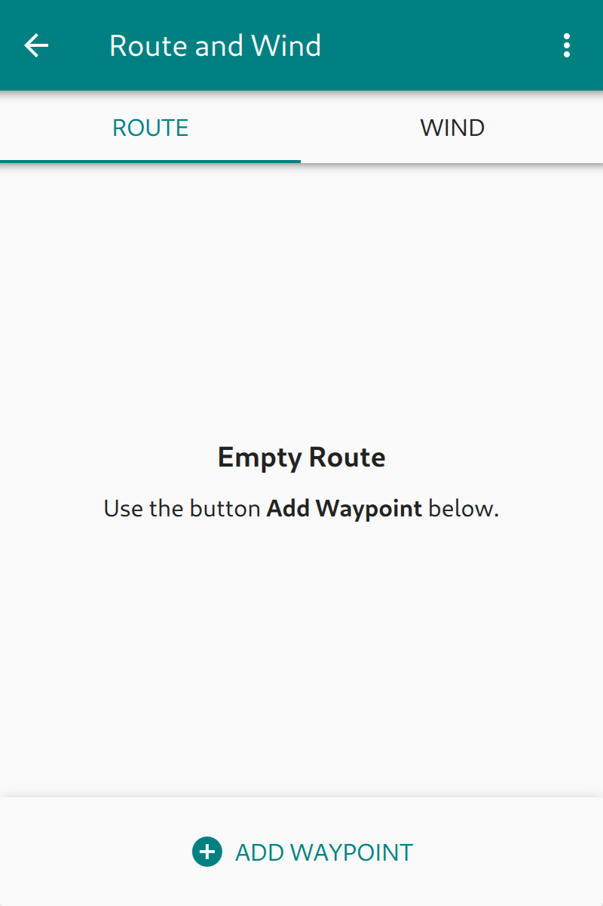
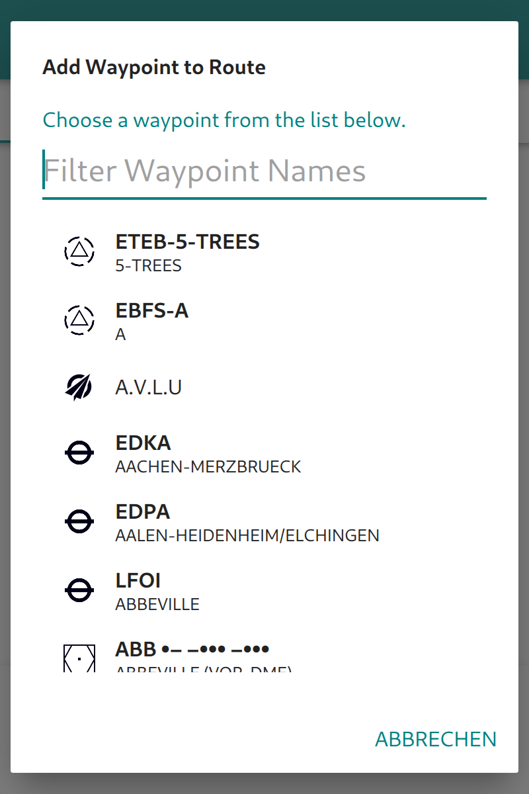

Plan a Flight
=============

**Enroute Flight Navigation** offers essential flight planning functionality:
you can display the route on the moving map and compute travel time and fuel
consumption estimates. Open the main menu and choose "Route and Wind." The page
will initially look like this:

   Flight route window, no route set

Once you specify the route and the wind, **Enroute Flight Navigation** will
compute travel time and fuel consumption, and the page may look like so:

   Flight route window, route set

This chapter will take you through the necessary steps.

Step 1: Set aircraft characteristics
-----------------------------------------

To compute travel time, **Enroute Flight Navigation** needs to know the cruise
speed of your aircraft. If you have followed this manual, you have entered this
piece of data after you downloaded the aviation map. If not, then please check
the section :ref:`setUpSetAircraft` again.

Step 2: Specify wind
--------------------

**Enroute Flight Navigation** also needs to know about the wind. If you are not
on the page "Route and Wind," open the main menu and choose the item "Route and
Wind."  On the page, select the tab "Wind" and enter an estimate for wind
direction and speed that you expect to encounter during your flight.

Step 3: Specify waypoints
-------------------------

**Enroute Flight Navigation** needs to know where you want to go. There are
several ways to specify the waypoints in your route.

- Enter waypoints by name
- Select waypoints in the moving map
- Import a route from the route library
- Import a GPX file from another program

Most users will enter the waypoints manually. Still, we explain all four methods
in some detail.

Enter waypoints by name
^^^^^^^^^^^^^^^^^^^^^^^

If you are not on the "Route and Wind" page, open the main menu and choose the
item "Route and Wind." On the page, select the "Route" tab. A tap on the field
"Add Waypoint" at the bottom of the page will open a dialog window showing a
long list with all waypoints from all aviation maps you have installed. Enter a
few letters of the waypoint name ("Freiburg") or ICAO code ("EDTF") to narrow
the list down. Once the desired waypoint becomes visible, a click will add it to
the route.

   Enter waypoints by name

Click on the field "Add Waypoint" again to enter more waypoints.

Select waypoints in the moving map
^^^^^^^^^^^^^^^^^^^^^^^^^^^^^^^^^^

It is possible to add waypoints directly from the moving map. To do that,
double-tap or tap-and-hold on any point of the moving map. The waypoint
description dialog will open.  

- Tap on the "Plus" sign to append the waypoint to the current route.

- Tap on "Direct to" to discard the current route and to add the current
  position and the given waypoint to your path.

- If the waypoint is already present in your route, you can tap on the "Minus"
  sign to remove it.

Import a route from the library
^^^^^^^^^^^^^^^^^^^^^^^^^^^^^^^

Section `Step 5: Save Route for Future Use`_ will show how to save a route to
the library for future use. If you have already saved a route to the library, go
to the open the main menu and choose the item "Library/Routes." The route
library page will open. Choose a route by tapping on the respective item in the
list.

Import a GPX file from another program
^^^^^^^^^^^^^^^^^^^^^^^^^^^^^^^^^^^^^^

To prepare your flight, you might want to use full-featured flight preparation
software or online services, such as `FL95 <https://fl95.de>`_. Most (if not
all) programs allow exporting the route in GPX format. Transfer the GPX file to
your device (using Bluetooth file transfer, Google Drive, sending yourself an
e-mail, or any other communication channel).

- On Android devices, it suffices to open the file. Depending on the mode of
  transfer, you have the option to open the file after the Bluetooth transfer,
  in the Google Drive App, or perhaps in the e-mail client.  **Enroute Flight
  Navigation** will automatically open and import the route. If more than one
  program on your device can handle GPX files, the system will ask you which
  program to use.

- On the Linux desktop, drag-and-drop the GPX file to the **Enroute Flight
  Navigation** window.

Step 4: Edit the route if necessary
-----------------------------------

It might be necessary to edit the route. If you are not on the "Route and Wind"
page, open the main menu and choose the item "Route and Wind." On the page,
select the "Route" tab.

Global functions
^^^^^^^^^^^^^^^^

The three-dot-menu in the upper right corner of the screen allows reversing the
route or deleting it entirely.

Waypoint-specific functions
^^^^^^^^^^^^^^^^^^^^^^^^^^^

The three-dot-menu to the right of each waypoint allows one to delete a specific
waypoint or move it up and down in the list. You can edit waypoints that do not
refer to pre-set airfields, navaids, or reporting points. Tap on the pencil
symbol to open a dialog that allows you to set a name and edit the coordinates.

Step 5: Save route for future use
---------------------------------

Once you are happy with the route, you might want to save it for future use. If
you are not on the "Route and Wind" page, open the main menu and choose the item
"Route and Wind." On the page, select the "Route" tab. The three-dot-menu in the
upper right corner of the screen allows saving the route to the library.
