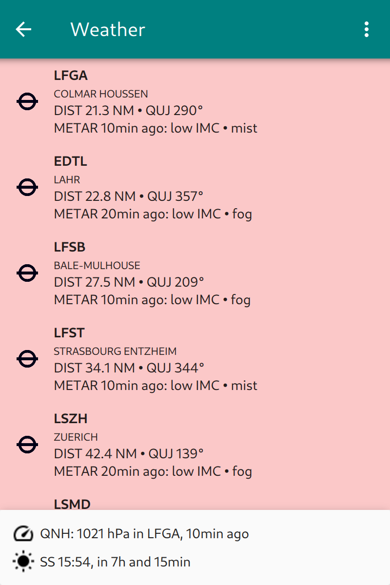

Check Weather
=============

**Enroute Flight Navigation** can show METAR reports and TAF forecasts from
nearby airfields along your route.  The data is updated frequently, provided
that an internet connection is available.  To check weather, open the main menu
and choose the item "Weather".  The weather information comes from the "Aviation
Weather Center", a website of the US government.  When you open the page for the
first time, **Enroute Flight Navigation** asks for your permission to access
that site. 

.. warning::
    The weather information shown by **Enroute Flight Navigation** might be
    outdated or otherwise wrong.  Assessment of meteorological flight conditions
    has to be done via an officially approved source of flight weather.  

As soon as weather information has been downloaded, the page will look like
this.

.. _weather:

   Weather information

The footer of the page shows the QNH of the closest airfield, as well as time of
sunset or sunrise.  The page body displays a list of stations that are within 85
nm around your current position or your intended flight route.  As you can see
in the picture, the following information is shown.

* ICAO identifier for Station and Airport name
* Distance and QUJ
* METAR summary

The entries are classified and colored according to the "aviation flight
categories" typically used in the United States. The coding scheme is explained
in the table below. Note that this color coding might be different from the
scheme typically used in your country. Green color does certainly **not** imply
that it is advisable (or legal) to fly.

+--------------+--------+-------------------------+-----+---------------+
| Category     | Color  | Ceiling                 |     | Visibility    |
+==============+========+=========================+=====+===============+
| low IFR      | Red    | <500 feet AGL           | or  | <1 mile       |
+--------------+--------+-------------------------+-----+---------------+
| IFR          | Red    | 500 -- 1,000 feet AGL   | or  | 1 -- 3 miles  |
+--------------+--------+-------------------------+-----+---------------+
| marginal VFR | Yellow | 1,000 -- 3,000 feet AGL | or  |  3 -- 5 miles |
+--------------+--------+-------------------------+-----+---------------+
| VFR          | Green  | >3,000 feet AGL         | and | > 5 miles     |
+--------------+--------+-------------------------+-----+---------------+

The detailed weather dialog
---------------------------

The following data will be displayed in the pop-up window when touching the
station line of a weather report:

    1. Station data including bearing and distance
    2. Current meteorological report (METAR)
    3. Decoded view of Current meteorological report
    4. Weather forecast for station (TAF, if available)
    5. Decoded view of weather forecast (if available)

The following Information will be displayed:
    1. Weather Menu
    2. Station data
    3. Meteorological data closest to own position

The menu of the Waether page will allow to:

* Update the METAR and TAF data
* Disallow he internet connection

The Weather overview window will provide the following information based on the METAR:

* ICAO identifier for Station and Airport name
* Distance and magnetic Bearing to Airport
* Time of METAR and summary weather state

On the lower end of the weather page the following data derived from the nearest station to your current position will be displayed:

* QNH
* Location and time of the report the QNH was extracted
* Sunset during day or Sunrise during night at current location
* Remaining time until sunset or sunrise

The information of each airport will be color coded by a system established by the US National Weather Service. The coding scheme is explained in the table below.
When touching a station line METAR and TAF (if available) will be shown in a weather detail sub-page. 
The following data will be displayed in the pop-up window when touching the station line of a weather report:

    1. Station data including bearing and distance
    2. Current meteorological report (METAR)
    3. Decoded view of Current meteorological report
    4. Weather forecast for station (TAF, if available)
    5. Decoded view of weather forecast (if available)

.. note::
    To view the full weather forecast you have to scroll down in most cases

.. caution::
    The color coding used for station weather does not match to European VFR criteria. Assessment of  meteorological flight conditions has to be done via an officially approved source of flight weather.

+----------------------------+------+---------------+----+------------------+
| Category                   | Color|   Ceiling     |    |   Visibility     |
+============================+======+===============+====+==================+
|IFR                         |Red   | 500 to below  | and| 1 mile to        |
|Instrument Flight Rules     |      | 1,000 feet AGL| /or| less than 3 miles|
+----------------------------+------+---------------+----+------------------+
|MVFR                        |Yellow| 1,000 to      | and|  3 to 5 miles    |
|Marginal Visual Flight Rules|      | 3,000 feet AGL| /or|                  |
+----------------------------+------+---------------+----+------------------+
|VFR                         |Green | greater than  | and| greater than     |
|Visual Flight Rules         |      | 3,000 feet AGL| /or| 5 miles          |
+----------------------------+------+---------------+----+------------------+

.. note::

    The  definition applied for IFR is ceiling less than 1,000 feet AGL.

.. note::
    The  definition applied for VFR  is ceiling greater than or equal to 3,000 feet AGL and visibility greater than or equal to 5 miles while MVFR is a sub-category of VFR.