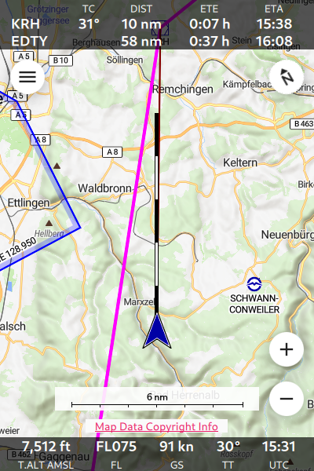
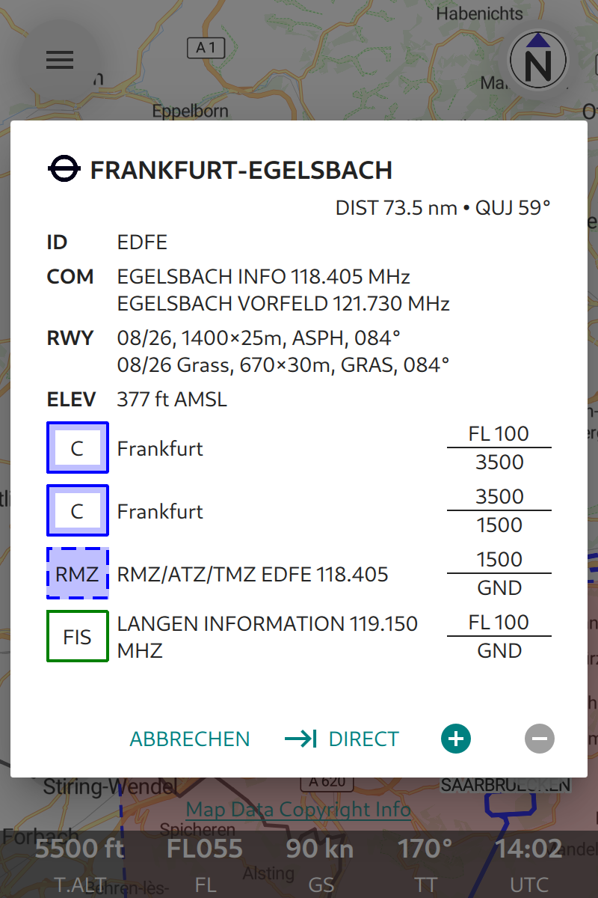

Main Page
=========

The main page is the page that you will use the most often. This is also the
page that opens when you start the app. The following image shows the Main Page
in a typical flight situation.

   The Main Page of **Enroute Flight Navigation**

- At the top of the screen, you see the `Route Information Bar`_, with
  information about the remaining flight route. 
- The `Page Body`_ shows a moving map with your current position and a number of
  interactive controls. 
- At the bottom, the `Navigation Bar`_ displays information about the current
  flight situation.

Route Information Bar
---------------------

If you have defined a flight route, the top of the Main Page will show a tabular
panel with one or two lines of information about the remaining route that you
still have to fly. The first line of the table refers to the next waypoint, the
second line to the final waypoint in your route.

====== ==============
Code   Meaning
====== ==============
WP     Name of the waypoint.
TC     True course to the waypoint (only shown for course to next waypoint).
DIST   Distance to the waypoint.
ETE    Estimated Time Enroute to the waypoint.
ETA    Estimated Arrival Time at the waypoint, in UTC.
====== ==============

- The units for the distance are chosen according to the settings on the
  Aircraft Page.
- If the information cannot be computed (e.g. because the positions is unknown,
  or because you are flying too far away from the route), the panel shows a
  brief error message. 
- Close to the final destination, the panel shows the words "Near destination."

Page Body
---------

The body of the main page shows a moving map and a few interactive controls that
will be described below.  The words "Bearing Mode" and "Autopan Mode" describe
two settings that govern the behaviour of the map display.

Bearing Mode
  The moving map can operate in two "bearing modes". In the mode "north up", the
  map is rotated so that the north direction is up, as you would expect from a
  paper map.  In the mode "track up", the map is rotated according to your
  direction of movement, so that your flight direction is up.
  
Autopan Mode
  If the autopan mode is on, the map is automatically moved, so that the
  position you aircraft is near the centre of the map display. If the autopan
  mode is off, the map is not moved and the position of your aircraft might not
  be visible on the map.

Gesture Controls
^^^^^^^^^^^^^^^^

The moving map can be controlled by standard gestures.

- **Mouse Wheel:** On desktop computers, the mouse wheel zooms in and out.
- **Pinch Gesture:** On touch-screen devices, the pinch gesture zooms in and
  out.
- **Pan Gesture:** On touch-screen devices, the pinch the pan gesture moves the
  map and sets the autopan mode to "off".
- **Tap-and-hold Gesture:** Tap-and-hold anywhere in the map to open the
  waypoint description dialog. This is the quickest way to obtain information
  about airfields, navaids, reporting points, terrain elevation and airspaces.
  The figure :ref:`wpInfo2` shows how this will typically look.
- **Double Tap Gesture:** The double tap gesture is equivalent to tap-and-hold.

.. _wpInfo2:

   Information about EDFE airport

Interactive Controls
^^^^^^^^^^^^^^^^^^^^

In addition to the pan and pinch gestures, you can use the following buttons to
control the app.

================================================= ========
Symbol                                            Function
================================================= ========
.. image:: ../01-intro/ic_menu.png                Opens main menu.
.. image:: ../01-intro/NorthArrow.png             Switches between modes **north up** and **track up**.
.. image:: ../01-intro/ic_my_location.png         Sets autopan mode to "on".
.. image:: ../01-intro/ic_add.png                 Zoom in.
.. image:: ../01-intro/ic_remove.png              Zoom out.
.. image:: ../01-intro/ic_airplanemode_active.png This control is shown when the app is not connected to a traffic data receiver. A click opens the traffic receiver status page.
================================================= ========

Ownship Position
^^^^^^^^^^^^^^^^

================================= ========
Symbol                            Function
================================= ========
.. image:: self-noPosition.png    Opens main menu.
.. image:: self-noDirection.png   Opens main menu.
.. image:: self-withDirection.png Opens main menu.
================================= ========

Initially, your own position is shown as a blue circle (or gray if the system
has not yet acquired a valid position).  Once you are moving, your own position
is shown as a blue arrow shape.  The flight path vector shows the projected
track for the next five minutes, sized so that each of the black and white
segments corresponds to one minute.

.. _flightVector2:

   Projected flight path for the next five minutes

Traffic Information
^^^^^^^^^^^^^^^^^^^

Navigation Bar
--------------

The bottom of the display shows a little panel with the following information.

====== ==============
Code   Meaning
====== ==============
T.ALT  True altitude (=geometric altitude).
FL     Flight level.
GS     Ground speed.
TT     True track.
UTC    Current time.
====== ==============

- Depending on the settings made in the :ref:`Settings Page`, the field T.ALT
  shows the altitude above sea level or the altitude above ground. This is
  indicated with the standard abbreviation "AMSL" or "AGL".
- The units for the altitude display are chosen according to the settings on the
  Aircraft Page.
- The flight level is only available if your device is connected to a traffic
  receiver (such as a PowerFLARM device) that reports the pressure altitude.
- The units for the ground speed display are chosen according to the settings on
  the Aircraft Page.
- Flight level and current time are hidden if the display is not wide enough.

.. warning:: Vertical airspace boundaries are defined by pressure altitudes
   (with respect to QNH or standard pressure).  Depending on temperature and air
   density, the pressure altitude will differ from the true altitude that is
   shown by the app.  **Never use true altitude to judge vertical distances to
   airspaces.**

